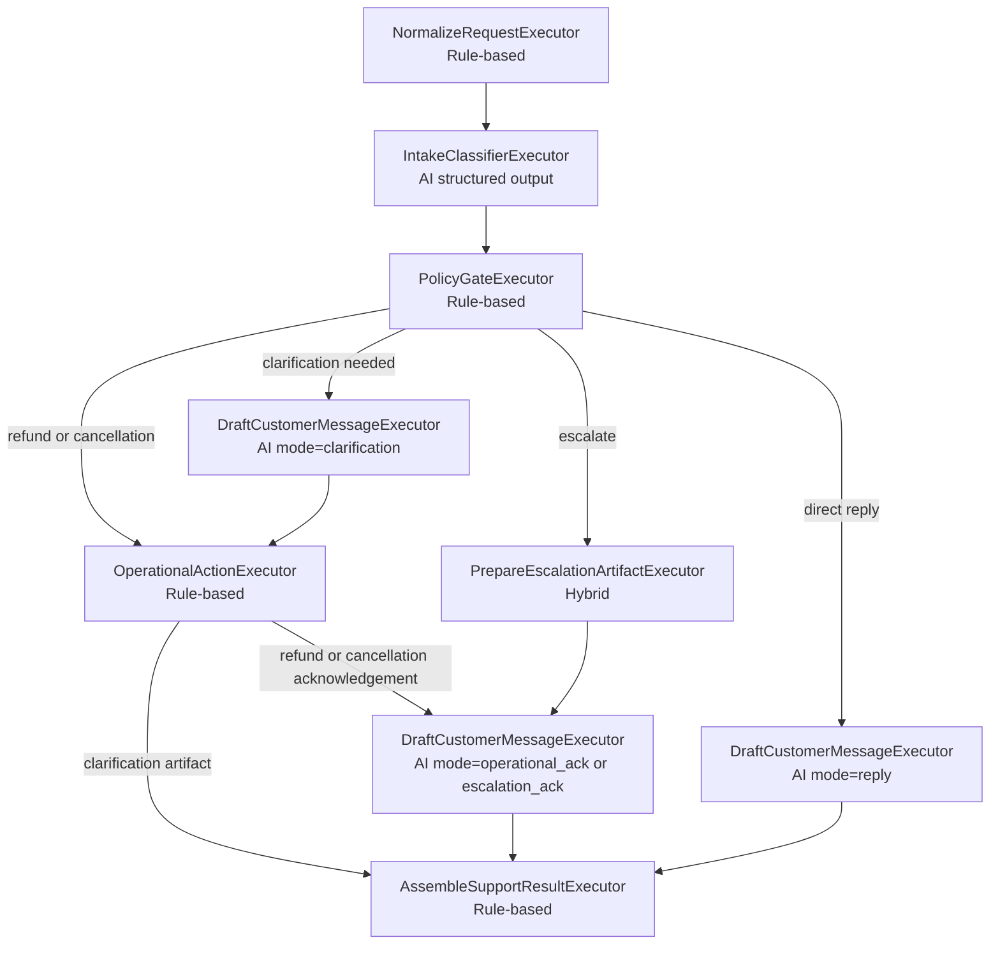

# Implementation Plan: Support Request Processing Flow

**Branch**: `[001-support-request-flow]` | **Date**: 2026-04-12 | **Spec**: [spec.md](./spec.md)
**Input**: Feature specification from `/specs/001-support-request-flow/spec.md`

**Note**: This template is filled in by the `/speckit.plan` command. See `.specify/templates/plan-template.md` for the execution workflow.

## Summary

Build the `support-agent-csharp` console prototype as a Microsoft Agent Framework workflow that combines AI-based intake and drafting with deterministic policy routing and local operational artifacts. The implementation will follow the same core pattern as `6-AgentFrameworkWorkflows`: `Azure.AI.OpenAI` supplies the `ChatClient`, `Microsoft.Agents.AI.OpenAI` powers agent executors, and `Microsoft.Agents.AI.Workflows` owns orchestration. The workflow will classify messy support requests into the existing `SupportRequestResult` contract, route via policy-gate decisions plus conditional edges, and keep outbound email/ticket behavior local to the console without external APIs.

## Logic Design

### Workflow Shape



### Executors

1. `NormalizeRequestExecutor` (rule-based)
  - Parse the pasted console email into sender, subject, and body when present.
  - Normalize whitespace and keep a raw/original copy for auditability.
  - Load the local handbook text and precompute deterministic keyword signals.

2. `IntakeClassifierExecutor` (AI, structured output)
  - Produce one intent classification, sentiment, urgency, missing-information list, and a short summary.
  - Keep this executor responsible for fuzzy language understanding only.

3. `PolicyGateExecutor` (rule-based)
  - Apply handbook rules deterministically.
  - Compute a route field such as `reply`, `clarification`, `refund_or_cancellation`, or `escalation`.
  - Decide `ActionTaken`, `RecommendedNextAction`, and operator-visible reasoning anchors.
  - Keep branching logic out of prompts and inside code so edges can stay thin.

4. `DraftCustomerMessageExecutor` (AI, mode-driven)
  - Reused with different modes: normal reply, clarification email, and escalation acknowledgement.
  - Constrained by route-specific instructions, sentiment-aware acknowledgement guidance, and handbook excerpts selected by the policy router.

5. `OperationalActionExecutor` (rule-based)
  - Create clarification-email dispatch preview, refund/cancellation ticket preview, or other local operational artifact.
  - Emit artifact details as workflow events and shared state, not external API calls.

6. `PrepareEscalationArtifactExecutor` (hybrid)
  - Deterministically decide escalation metadata such as tag, SLA, and queue.
  - Optionally use a short LLM call for concise handoff summary text if needed, while keeping routing deterministic.

7. `AssembleSupportResultExecutor` (rule-based)
  - Read shared state and build the final `SupportRequestResult`.
  - Ensure all required fields are populated and enums map to allowed values.

### Executor Contracts

The workflow should use explicit message contracts between executors, not implicit access to prior objects. Shared state is still used for observability and final assembly, but each edge should carry a typed payload.

| Executor | Input Contract | Output Contract | Shared State Writes | Notes |
|-----------|----------------|-----------------|---------------------|-------|
| `NormalizeRequestExecutor` | `string` raw console input | `ParsedSupportRequest` | `WorkflowRequestState` | Start executor; parses headers if present and normalizes body text. |
| `IntakeClassifierExecutor` | `ParsedSupportRequest` | `IntakeContext` | `WorkflowAssessmentState` | `IntakeContext` wraps the parsed request plus structured intake assessment so downstream executors do not need to reload raw text. |
| `PolicyGateExecutor` | `IntakeContext` | `PolicyContext` | `WorkflowDecisionState` | `PolicyContext` wraps parsed request + intake + policy decision so conditional edges can route from one object. |
| `DraftCustomerMessageExecutor` | `PolicyContext` or `OperationalActionContext` or `EscalationContext` | `DraftedResponseContext` | `WorkflowArtifactState` | Multi-handler executor is acceptable here, following the same pattern as multi-input executors in `6-AgentFrameworkWorkflows`. It normalizes route-specific inputs into one common draft output contract. |
| `OperationalActionExecutor` | `PolicyContext` or `DraftedResponseContext` | `OperationalActionContext` | `WorkflowArtifactState` | Handles local artifacts such as clarification email preview, refund ticket preview, or cancellation task preview. It should emit one typed action context instead of loose strings. |
| `PrepareEscalationArtifactExecutor` | `PolicyContext` | `EscalationContext` | `WorkflowArtifactState` | Produces a deterministic escalation package plus any short AI-generated summary text. |
| `AssembleSupportResultExecutor` | `DraftedResponseContext` or `OperationalActionContext` or `EscalationContext` | `SupportRequestResult` | Final run state snapshot | Final multi-handler executor reads common fields plus any branch artifact and produces the single canonical result. |

#### Planned Context Types

1. `IntakeContext`
  - Fields: `ParsedSupportRequest Request`, `IntakeAssessment Intake`
  - Purpose: preserve normalized request data alongside AI classification output.

2. `PolicyContext`
  - Fields: `ParsedSupportRequest Request`, `IntakeAssessment Intake`, `PolicyDecision Policy`
  - Purpose: single routing object used by all conditional edges after policy evaluation.

3. `OperationalActionContext`
  - Fields: `PolicyContext PolicyContext`, `SimulatedArtifact Artifact`, `string? OperatorNote`
  - Purpose: branch contract for clarification, refund, and cancellation local actions.

4. `EscalationContext`
  - Fields: `PolicyContext PolicyContext`, `SimulatedArtifact Artifact`, `string Queue`, `string Sla`, `IReadOnlyList<string> NextSteps`
  - Purpose: escalation-specific branch contract before drafting acknowledgement and final assembly.

5. `DraftedResponseContext`
  - Fields: `PolicyContext PolicyContext`, `CustomerMessageDraft Draft`, `SimulatedArtifact? Artifact`
  - Purpose: common contract consumed by the final assembler regardless of whether the route was reply, clarification, refund/cancellation, or escalation acknowledgement.

#### Branch Contract Flow

1. Direct reply route
  - `PolicyContext` -> `DraftCustomerMessageExecutor` -> `DraftedResponseContext` -> `AssembleSupportResultExecutor`

2. Clarification route
  - `PolicyContext` -> `DraftCustomerMessageExecutor(mode=clarification)` -> `DraftedResponseContext`
  - `DraftedResponseContext` -> `OperationalActionExecutor` -> `OperationalActionContext`
  - `OperationalActionContext` -> `AssembleSupportResultExecutor`

3. Refund or cancellation route
  - `PolicyContext` -> `OperationalActionExecutor` -> `OperationalActionContext`
  - `OperationalActionContext` -> `DraftCustomerMessageExecutor(mode=operational_ack)` -> `DraftedResponseContext`
  - `DraftedResponseContext` -> `AssembleSupportResultExecutor`

4. Escalation route
  - `PolicyContext` -> `PrepareEscalationArtifactExecutor` -> `EscalationContext`
  - `EscalationContext` -> `DraftCustomerMessageExecutor(mode=escalation_ack)` -> `DraftedResponseContext`
  - `DraftedResponseContext` -> `AssembleSupportResultExecutor`

This is the key contract rule: edges pass typed context objects; shared state is supplementary and should not replace the edge payload as the primary contract between executors.

### Edge Strategy

1. Use direct edges for the shared pipeline: normalize -> intake -> policy.
2. `PolicyGateExecutor` computes the route and policy metadata; conditional edges read that route and stay intentionally thin.
3. This mirrors the reference `6-AgentFrameworkWorkflows` design, where `PolicyGateExecutor` owns policy decisions and `Program.cs` wires route conditions.
4. Keep route branches mostly sequential to avoid unnecessary synchronization complexity in the first workshop version.
5. Use shared workflow state for branch artifacts so the final assembler can compose one deterministic result.

### Policy Routing Rules

`PolicyGateExecutor` will decide route and action from handbook-backed rules in this priority order:

1. Escalation route
  - Trigger when the request explicitly asks for a manager or supervisor.
  - Trigger when the message mentions lawyers, legal threats, regulators, GDPR, or chargebacks.
  - Trigger when the billing dispute is over `$100`.
  - Trigger when the message indicates repeated unresolved contact, such as "third time" or equivalent.
  - Trigger when the message is abusive enough that the handbook says to escalate instead of engage.

2. Clarification route
  - Trigger when the request cannot be safely handled because required facts are missing.
  - Examples: duplicate-charge complaint without date or amount, unclear whether the user wants cancellation or refund, billing confusion with no concrete ask.
  - Clarification blocks refund/cancellation operations until enough information exists.

3. Refund or cancellation operational route
  - Trigger when the customer clearly requests a refund or cancellation and there is enough information to prepare the relevant local artifact.
  - Refund logic uses handbook rules such as first-month flexibility, billing error handling, and refusal of multi-month retroactive refunds for forgotten cancellations.
  - Cancellation logic uses handbook rules such as immediate cancellation with access through the paid billing period and data retention of about 90 days.

4. Direct reply route
  - Trigger for plan questions, policy explanations, and normal complaints that do not meet escalation or clarification rules.
  - Apply explicit guardrails for unsupported exceptions, prohibited disclosures, no pause feature, and no partial-month downgrade credits.

### AI vs Rule Boundary

1. AI steps: messy language understanding and customer-facing text drafting.
2. Rule-based steps: handbook enforcement, escalation/refund/cancellation policy decisions, route selection, and simulated operational side effects.
3. Hybrid step: escalation package preparation, where summarization may use AI but escalation eligibility remains deterministic.

## Technical Context

<!--
  ACTION REQUIRED: Replace the content in this section with the technical details
  for the project. The structure here is presented in advisory capacity to guide
  the iteration process.
-->

**Language/Version**: C# on .NET 10 (`net10.0`)  
**Primary Dependencies**: `Azure.AI.OpenAI` 2.1.0, `Microsoft.Agents.AI.OpenAI` 1.1.0, `Microsoft.Agents.AI.Workflows` 1.1.0, `Microsoft.Extensions.AI`, existing configuration packages  
**Storage**: N/A for persistent storage; local markdown files for handbook and sample requests; workflow shared state in memory  
**Testing**: `dotnet test` with xUnit for unit and workflow integration tests  
**Target Platform**: Console application on developer workstation (Windows-first, cross-platform .NET compatible)
**Project Type**: Single-project CLI / console app with workflow orchestration  
**Performance Goals**: Typical sample request completes in under 5 seconds on a workshop machine excluding network spikes; console output remains easy to review in under 30 seconds  
**Constraints**: One-pass processing only, no external email/ticket APIs, handbook-grounded policy enforcement, exact `SupportRequestResult` contract, latest MAF workflow syntax  
**Scale/Scope**: Single-request prototype processing dozens of workshop scenarios, not a concurrent production service

## Constitution Check

*GATE: Must pass before Phase 0 research. Re-check after Phase 1 design.*

The constitution file is still a placeholder template and defines no enforceable project-specific gates. The effective gates for this feature are:

1. Plan stays inside the `support-agent-csharp` skeleton only.
2. MAF choices are based on current docs/source rather than recalled preview APIs.
3. Policy-sensitive behavior remains deterministic where the spec requires it.

Post-design re-check: PASS. The proposed workflow preserves these gates.

## Project Structure

### Documentation (this feature)

```text
specs/001-support-request-flow/
├── plan.md              # This file (/speckit.plan command output)
├── research.md          # Phase 0 output (/speckit.plan command)
├── data-model.md        # Phase 1 output (/speckit.plan command)
├── quickstart.md        # Phase 1 output (/speckit.plan command)
├── contracts/           # Phase 1 output (/speckit.plan command)
└── tasks.md             # Phase 2 output (/speckit.tasks command - NOT created by /speckit.plan)
```

### Source Code (repository root)
<!--
  ACTION REQUIRED: Replace the placeholder tree below with the concrete layout
  for this feature. Delete unused options and expand the chosen structure with
  real paths (e.g., apps/admin, packages/something). The delivered plan must
  not include Option labels.
-->

```text
support-agent-csharp/
├── Program.cs
├── support-agent-csharp.csproj
├── appsettings.json
├── appsettings.Development.json
├── Data/
│   ├── support_handbook.md
│   └── sample_requests.md
├── Common/
│   ├── ConsoleUi.cs
│   └── SupportRequestRenderer.cs
├── Models/
│   ├── SupportRequestResult.cs
│   ├── IntakeAssessment.cs              # planned
│   ├── PolicyDecision.cs                # planned
│   ├── CustomerMessageDraft.cs          # planned
│   └── SimulatedArtifact.cs             # planned
├── Workflow/                            # planned
│   ├── Executors/
│   ├── Events/
│   └── State/
├── Agents/                              # planned agent factory / prompt builders
├── Orchestration/
│   └── SupportRequestProcessor.cs
└── Tests/                               # planned if kept in-project, otherwise sibling test project
```

**Structure Decision**: Extend the existing `support-agent-csharp` single-project skeleton rather than introducing a second service. Add workflow-specific folders alongside the current `Models`, `Agents`, and `Orchestration` directories so the console entry point remains simple while the workflow graph stays explicit and testable.

## Complexity Tracking

> **Fill ONLY if Constitution Check has violations that must be justified**

| Violation | Why Needed | Simpler Alternative Rejected Because |
|-----------|------------|-------------------------------------|
| None | N/A | N/A |
