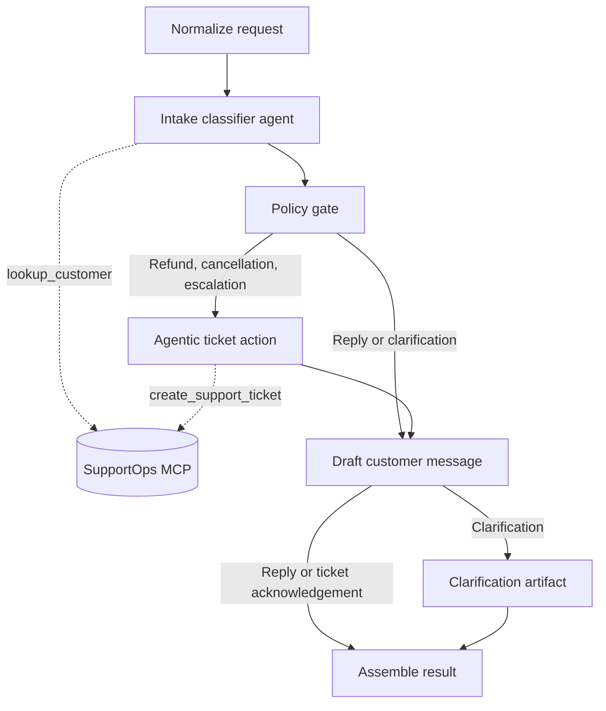

# Support Agent Workflow

The workflow keeps routing deterministic, but lets agents use MCP tools at the right boundary.

`lookup_customer` may enrich intake before policy rules run. `create_support_ticket` is only available after the policy gate chooses a ticket-required route.

Created tickets are persisted by the MCP server under `support-ops-mcp-csharp/storage/` as Markdown files. That folder is ignored by git.
