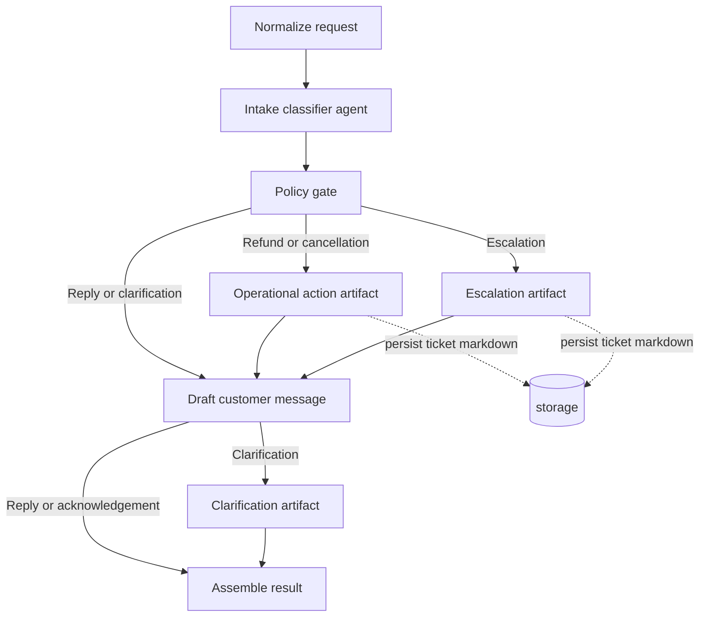

# Support Agent Workflow

The workflow keeps routing deterministic and uses agents for classification and message drafting. Ticket-like artifacts are persisted locally under `support-agent-csharp/storage/`.

`Agent Trace` lines are emitted while the workflow runs so the console shows intake, policy, artifact, drafting, storage, and final assembly progress.
